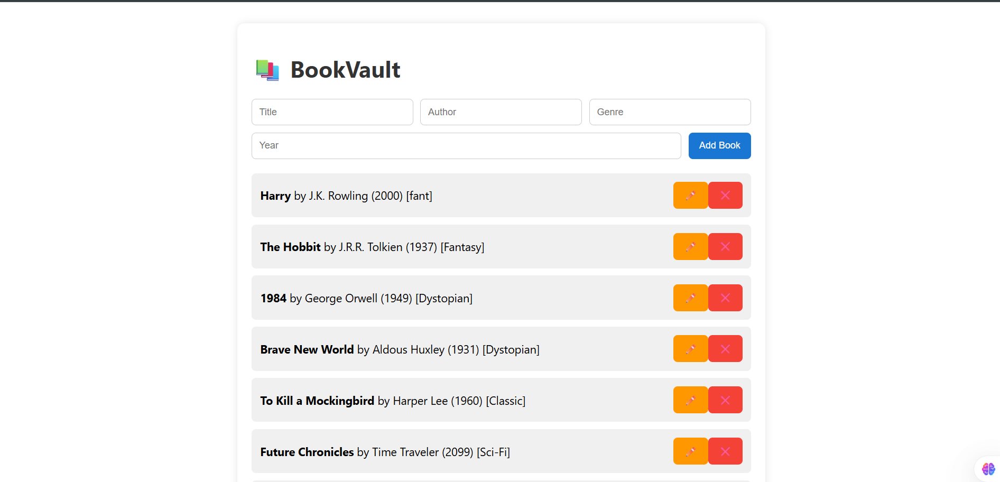
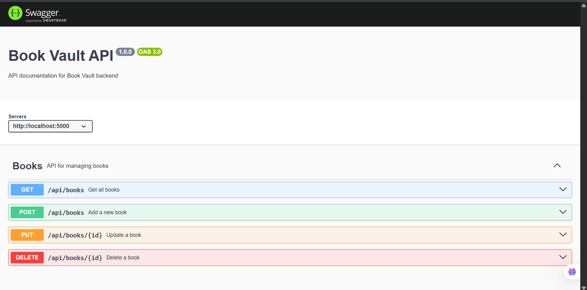
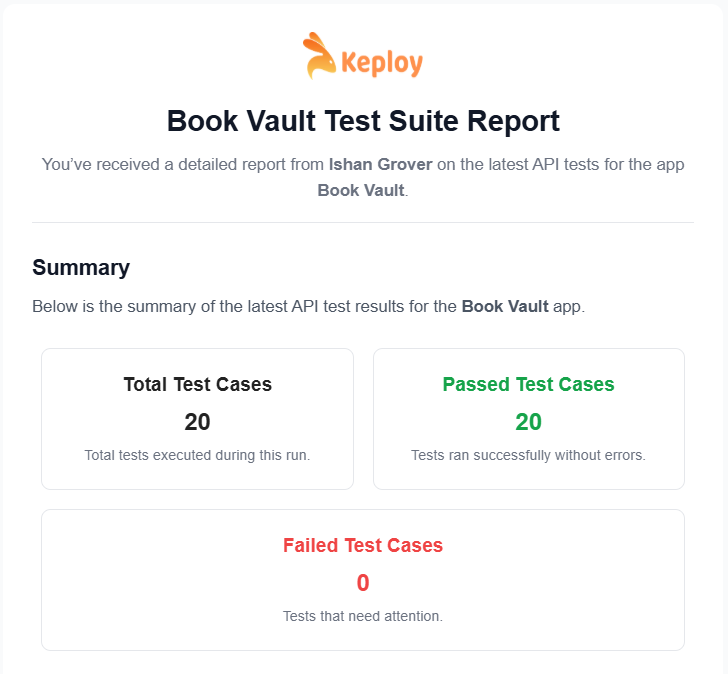
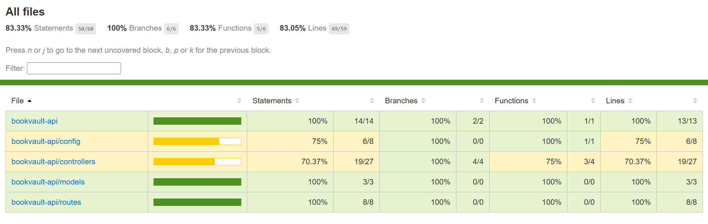

# 📚 BookVault – Custom Fullstack API Project

**BookVault** is a full-stack application that allows users to manage their personal book collection. It includes a custom-built API server using Express and MongoDB and a React-based frontend to perform CRUD operations on the books.

<p align="center">
  
</p>

---

## 🚀 Features

- 📖 Add a new book with title, author, genre, and year
- ✏️ Edit existing book entries
- ❌ Delete books
- 📂 List all books in a neat interface
- 🔗 API fully connected to MongoDB with RESTful endpoints
- ✅ Create, Read, Update, Delete (CRUD) books
- ✅ Auto-generated Swagger documentation (`OpenAPI 3.0`)
- ✅ Keploy-based test case generation
- ✅ CI/CD integration with GitHub Actions

---

## 🧪 API Documentation (Swagger)

- Swagger UI is available at: [http://localhost:5000/api-docs](http://localhost:5000/api-docs)
- OpenAPI JSON schema is served at: [http://localhost:5000/api-docs-json](http://localhost:5000/api-docs-json)
<p align="center">
  
</p>

---

## 🔁 Keploy API Testing Integration

This project uses [Keploy](https://keploy.io) to record and replay API calls for test generation using real-time traffic, helping achieve high test coverage automatically.
<p align="center">
  
</p>

---

## 🔄 CI/CD Integration with Keploy

This project is integrated with GitHub Actions for automated testing using Keploy, which generates and runs API tests based on real traffic.

Every push or pull request to the main branch automatically triggers the following:

✅ Starts the API server
✅ Executes Keploy test-suite in cloud mode
✅ Uploads test results to [Keploy Cloud Dashboard](https://keploy.io)
✅ [Keploy CI/CD Integration Documentation](https://keploy.io/docs/running-keploy/api-testing-cicd/)

## 🛠️ GitHub Actions Workflow File

```ymal
name: Run Keploy CI/CD Tests

on:
  push:
    branches: [ main ]
  pull_request:
    branches: [ main ]

jobs:
  keploy-tests:
    runs-on: ubuntu-latest
    defaults:
      run:
        working-directory: ./bookvault-api

    steps:
      - name: Checkout Repository
        uses: actions/checkout@v3

      - name: Setup Node.js
        uses: actions/setup-node@v3
        with:
          node-version: 18

      - name: Install Dependencies
        run: npm install

      - name: Start API Server
        run: |
          nohup npm start &
          sleep 10

      - name: Install Keploy CLI
        run: |
          curl --silent -L https://keploy.io/ent/install.sh | bash

      - name: Run Keploy Test Suite
        run: |
          export KEPLOY_API_KEY=${{ secrets.KEPLOY_API_KEY }}
          keploy test-suite --app=03d24177-315c-4ee1-a3ac-64ed0ab38567 --base-path http://localhost:5000/api/books --cloud
```

---

### 📄 Example Endpoint:

```http
POST /api/books

Request Body:
{
  "title": "Harry Potter",
  "author": "J.K. Rowling",
  "yearOfPublishing": 1997,
  "genre": "Fantasy"
}
```

## 🧠 Task Overview

This project is built for the following requirements:

- ✅ **Custom API** with at least 4 CRUD endpoints
- ✅ **Database Integration** using MongoDB
- ✅ **Frontend Integration** using React (Optional Task ✅ Completed)
- ✅ **API Documentation** (See below)
- ✅ **Tested via Frontend and Postman**
- ✅ **Code Shared on GitHub**

---

## 🛠️ Tech Stack

| Layer     | Tech Used                        |
|-----------|----------------------------------|
| Frontend  | React, Axios                     |
| Backend   | Node.js, Express                 |
| Database  | MongoDB                          |
| Tools     | Nodemon, dotenv, Swagger, Keploy |

---

## 🗂️ Project Structure
```
bookvault-fullstack/
├── bookvault-api/ # Backend Folder
│ ├── config/db.js # MongoDB connection
│ ├── controllers/bookController.js
│ ├── models/Book.js
│ ├── routes/bookRoutes.js
│ ├── tests/ # Unit & Integration tests
│ │   ├── bookController.test.js
│ │   └── bookRoutes.int.test.js
│ │   └── bookRoutes.test.test.js
│ ├── server.js # Entry point
│ └── .env # Environment Variables
├── bookvault-frontend/ # Frontend Folder
│ ├── public/index.html
│ ├── src/App.js # React App
│ └── package.json
└── .github/
    └── workflows/
        └── keploy.yml  
```
---

## 🌐 API Documentation

| Endpoint              | Method | Description             |
|-----------------------|--------|-------------------------|
| `/api/books`          | GET    | Get all books           |
| `/api/books`          | POST   | Add a new book          |
| `/api/books/:id`      | PUT    | Update a book by ID     |
| `/api/books/:id`      | DELETE | Delete a book by ID     |

### 🔸 Sample POST request

```json
POST /api/books
{
  "title": "The Alchemist",
  "author": "Paulo Coelho",
  "genre": "Fiction",
  "publishedYear": 1988
}
```

## 🧪 How to Run the Project
🖥️ Backend (bookvault-api)

Go to the backend directory:
```bash
git clone https://github.com/imishangrover/Book-Vault.git
cd Book-Vault/bookvault-api
```

Create a .env file and add:
```env
MONGO_URI=your_mongodb_connection_string
PORT=5000
```

Install dependencies and start the server:
```bash
npm install
npm run dev
```

You should see:
```
Server running on port 5000
MongoDB connected
```

🌐 Frontend (bookvault-frontend)

Open a new terminal and go to the frontend directory:
```
cd bookvault-frontend
```

Install dependencies:
```
npm install
```

Start the React frontend:
```
npm start
```

Open in browser:
```
http://localhost:3000
```

## 📦 How to Use the App
Fill in the book fields → click Add Book

Click ✏️ to edit → update values → click Update Book

Click ❌ to delete a book

## 🧪 Testing

This project uses **Jest**, **Supertest**, and **mongodb-memory-server**.

### 🧪 Test Types:
- Unit tests (with mocks)
- Integration tests (with real in-memory MongoDB)
- API endpoint tests

### 🔧 Run Tests

```bash
npm install
npm test
```
### 🧪 Test Coverage Report
<p align="center">
  
</p>

---
## 📄 License

This project is licensed under the MIT License - see the [LICENSE](./LICENSE) file for details.

---
## 👨‍💻 Author

**Ishan Grover** – [@imishangrover](https://github.com/imishangrover)
